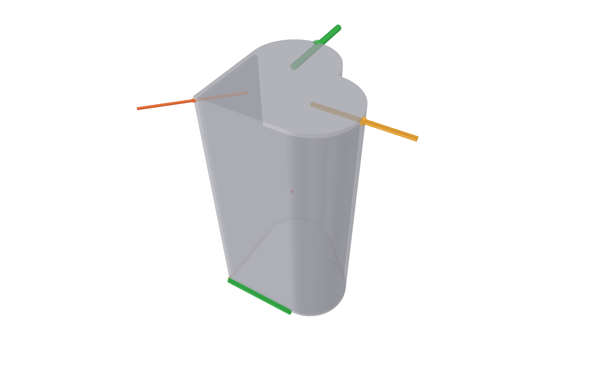

# Push Selection Pipeline

Automatic selection of a tipping edge and push contact configuration from an object mesh.

## What Changed

The pipeline and runner now include the following updates:

1. Batch runner processes exactly 4 experiment objects:
  - box
  - heart
  - flashlight
  - monitor
2. Batch runner writes one standalone PNG per object:
  - box.png
  - heart.png
  - flashlight.png
  - monitor.png
3. CoM handling in batch mode now matches single-object mode:
  - 2D CoM is computed from mesh.center_mass at runtime
4. Exported PNG camera is deterministic and isometric-like for all objects.
5. Arrow thickness/length was increased to improve visibility in automatic renders.

## Files

| File | Description |
|------|-------------|
| push_selection_pipeline.py | Core geometry pipeline, scoring, visualization, and PNG export |
| run_push_selection.py | Batch runner for the four experiment meshes and per-object PNG output |

## Pipeline Summary

Given a mesh and a 2D CoM:

1. Extract support polygon from base vertices.
2. Compute candidate tip edges and rank by CoM distance.
3. Extract top-band hull points.
4. Pair each selected tip edge with a push point using perpendicular slab projection.
5. Score and rank candidates.
6. Visualize best-ranked candidates and export PNG.

Current scoring terms in the core pipeline:

- orthogonality
- tipping_ease
- leverage
- edge_stability
- loa_closeness (when LoA enforcement is enabled)

## Batch Runner Usage

Run from repository root:

```bash
python push_selection/run_push_selection.py
```

Or from the push_selection folder:

```bash
python run_push_selection.py
```

Supported flags:

```bash
python run_push_selection.py --loa-epsilon 0.02
python run_push_selection.py --top-k 3
python run_push_selection.py --output-dir ../figures/push_selection
```

Notes:

1. The runner always processes box, heart, flashlight, and monitor.
2. Output defaults to the push_selection folder.
3. PNG export uses a fixed isometric-like camera setup.

## Programmatic Usage

```python
import numpy as np
from push_selection_pipeline import load_object_mesh, select_push_config, visualize_ranked_pairs

mesh = load_object_mesh("path/to/object.stl")
com = mesh.center_mass
com_2d = np.array([com[0], com[1]], dtype=float)

ranked = select_push_config(mesh, com_2d, verbose=True)
visualize_ranked_pairs(
   mesh,
   ranked,
   com_2d,
   top_n=3,
   show=False,
   save_png_path="object.png",
)
```

## Figures

### Box


### Heart



### Flashlight


### Monitor


## Dependencies

```bash
pip install trimesh numpy scipy
```
